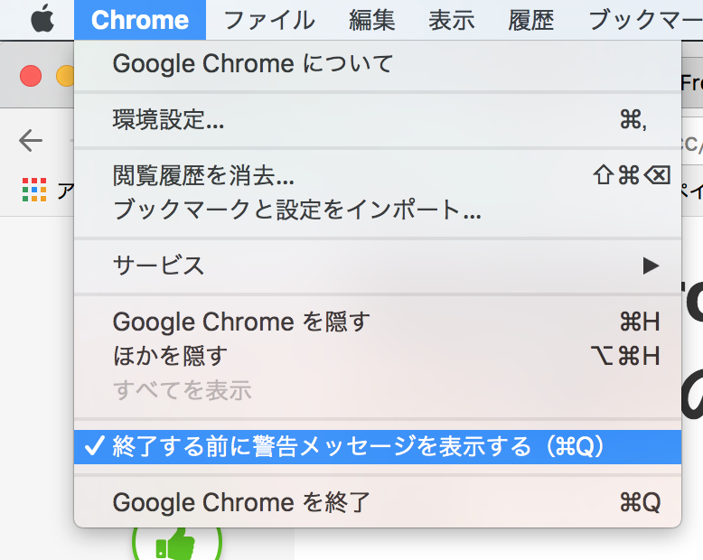

+++
date = "2018-02-14T21:02:24+09:00"
draft = false
title = "Command+Qの恐怖から解放"
slug = "command-q"
tags = ["ショートカットの弊害","Q怖い"]
image = ""
excerpt = ""
bgcolor = false
comments = true	# set false to hide Disqus
share = true	# set false to hide share buttons
menu= ""		# set "main" to add this content to the main menu
+++

Command + Q で間違えて強制終了しちゃうのが地味〜にストレスだったので  
なんとかしたくて色々探したというお話。  

 
### Chromeの設定  

ぴろさんに教えてもらったChromeの設定。  

メニュー → Chrome → 終了する前に警告メッセージを表示する  
にチェックを入れる。  

  

Chrome で Command + Q をしちゃうと  
残しておきたいタブとかが一気に消えて結構絶望するので  
良い機能だなって思いました！  

ですが私は1000ch先輩からショートカットの義務教育を受けているので  
アプリ切り替えに Command + Tab を使っています。  

  

このアプリ切り替えをしているときにCommand + Q を押すと  
警告メッセージなしで終了しちゃうんです...  

なんで Tab と Q って隣なんですかね。  

 
### 強制終了のキーバインド変える  

デフォルトのキーバインドから変えたくなかったので（変な癖をつけたくない）  
これは最初から除外していました。  

そういえばもうJIS配列で慣れちゃったけどUS配列にした方がよかったかなぁ  

 
### QBlocker  

個人的ベストプラクティスはQBlockerでした🎉  

https://qblocker.com/  

**Command + Q** 長押しで強制終了してくれるアプリ。  

キーバインドもそのままだし、  
**Command + Tab** のアプリ切り替えのときも守ってくれる！  

長押しの時間も、除外するアプリも設定できるみたい。  

良い感じ〜  

