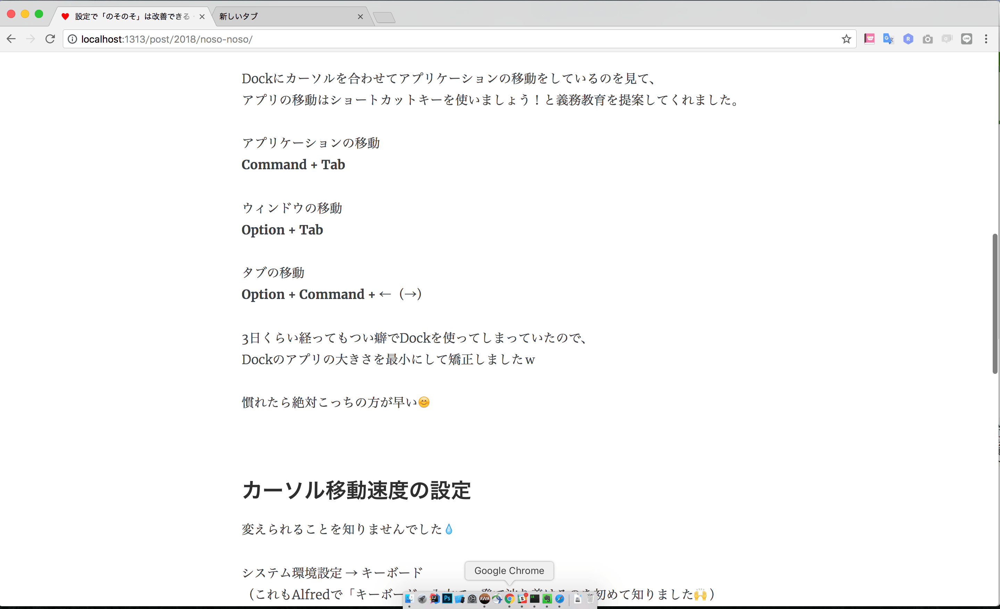
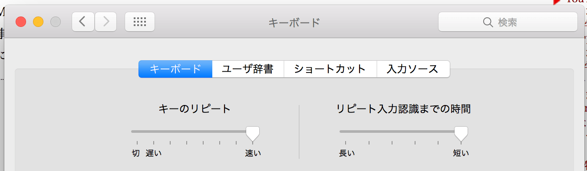

+++
date = "2018-01-29T21:02:24+09:00"
draft = false
title = "設定で「のそのそ」は改善できる"
slug = "noso-noso"
tags = ["義務教育", "1000ch", "先輩", "神"]
image = ""
excerpt = ""
bgcolor = false
comments = true	# set false to hide Disqus
share = true	# set false to hide share buttons
menu= ""		# set "main" to add this content to the main menu
+++

はじめに。  

わたしは動きが「のそのそ」しています。  
ずっと親族に言われ続けてきましたが、あまり気にしていませんでした。  

ただ、仕事が遅いのは困りますね。。  

<br>
### 1000ch先輩の義務教育  

去年の終わり頃からプロジェクトでお世話になっている  
1000ch先輩にショートカットキーやカーソル移動速度などの設定を教えてもらいました。  
（もう5年目なのに...本当にありがとうございます🙇 ）  

IDEはショートカット使ってすごい速いのにｗ  
って言って教えてくれました。（優しい）  

<br>
### ショートカットキーの義務教育  

Dockにカーソルを合わせてアプリケーションの移動をしているのを見て、  
アプリの移動はショートカットキーを使いましょう！と義務教育を提案してくれました。  


アプリケーションの移動  
**Command + Tab**  

ウィンドウの移動  
**Option + Tab**  

タブの移動  
**Option + Command + ←（→）**  


3日くらい経ってもつい癖でDockを使ってしまっていたので、Dockのアプリの大きさを最小にして矯正しましたｗ  

  

慣れたら絶対ショートカットの方が早い😊  


<br>
### カーソル移動速度の設定  

変えられることを知りませんでした💧  

システム環境設定 → キーボード  
（これもAlfredで「キーボード」入力で一発で辿り着けるのを初めて知りました🙌）  

キーのリピート、リピート入力認識までの時間の設定を変えました。  

  


どっちも最速ｗ  


<br>
### アプリを指定して開くopen

```zsh
$ open . -a [アプリ名]
```
```zsh
$ open . -a Visual\ Studio\ Code
```
とかとか。  
頭文字入れたらTabで候補出てくるし、便利！（Tabで候補はzshの設定かも？）  

そういえばずっとJetBrainsのIDEを使っているのですが、  
謎に充電をドカドカ消費するようになってしまって急遽VSCode使ってます。  
なんでだろ。。  

<br>
### 画面のフィッティングアプリ  

Spectacle を入れました。  
他のアプリのショートカットと競合しないように  

全画面： **Option + Command + F**  
左寄せ： **Option + ←**   
右寄せ： **Option + →**  

にしました◎  
他は使わないのでOFFに〜  

<br>
### おわり  

こんな感じでちょっぴりスピードアップしました〜〜  
やったね！  
