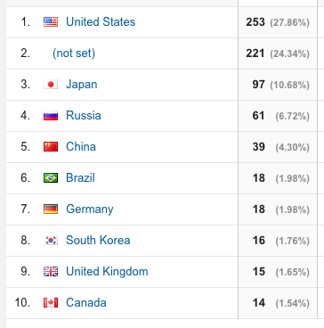

+++
bgcolor = false
comments = true
date = "2015-08-10T20:18:33+09:00"
draft = false
excerpt = "このブログのGoogleアナリティクスを眺めてたら、海外からのアクセスがすごい多くて...(´・ω・｀)極度のビビリ症なので「何か攻撃仕掛けられてるんじゃないか...」と、被害妄想に陥り海外からのアクセスをシャットアウトしたいと思った次第です"
image = ""
outside = false
slug = "access-only-japan"
tags = ["ga"]
title = "海外からのアクセスを禁止したい"

+++

このブログのGoogleアナリティクスを眺めてたら、  
海外からのアクセスがすごい多くて...(´・ω・｀)  

極度のビビリ症なので「何か攻撃仕掛けられてるんじゃないか...」と、被害妄想に陥り  
海外からのアクセスをシャットアウトしたいと思った次第です。  

 
### こんな感じのアクセス

海外多い・・・日本語でしか書いてないのに何で？  

 
### IP制限

最初に思い付いたのが、日本のIPだけアクセスを許可するやつで、htaccessを使ってアクセス制限する方法です。  
以下のサイトを参考にやってみました。  

[IPアドレスで日本国外(海外/外国)からのアクセスを制限する](http://www.cgis.biz/tools/access/)  

アクセス制限できたのかは不明。。海外のIPに偽装してサイトをチェックできるchromeアドオン入れてみたけど動かなかった...もういいや。  

（追記：3日くらい経ってもru等からのアクセスあるからたぶん失敗だ^q^）  

 
### リファラスパム

GAでリファラ見ていたらfloatingほげほげ的なサイトからのアクセスが大量にあって（しかも直帰ばかり）、なんだろう〜と思ったらリファラスパムというものらしい。  
なんか怖いしデータ見づらいのでそいつを除外したい。  

[リファラースパムリスト Google Analytics](http://matome.naver.jp/odai/2142138671904593001)  
[リファラースパム！？Google Analyticsでのアクセス数の伸びに注意！](http://www.yatani-pr.com/marketingblogs/1402/)  

この辺を参考に、フィルタを作った。今度はうまくいくかな〜〜  

 
### GAIQ...
GAIQ取ったけどGAの何を見たら良いのかよくわからん〜  
view数のばしたいわけでもないし・・・うーん。。  
