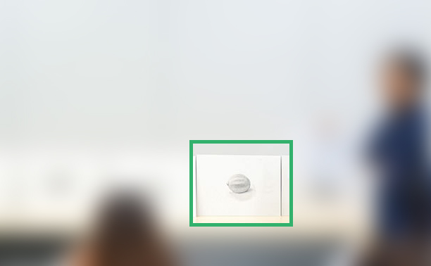
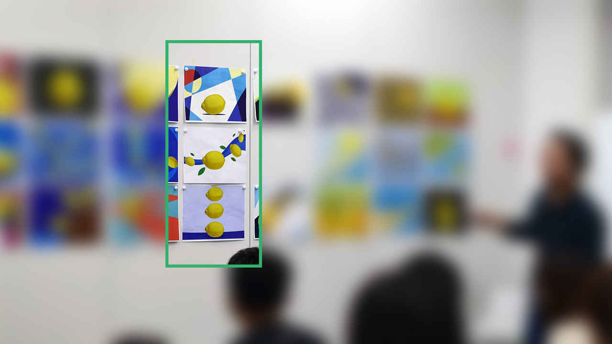
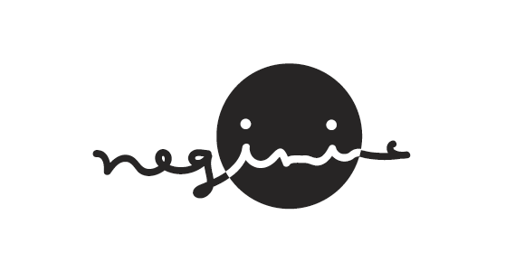
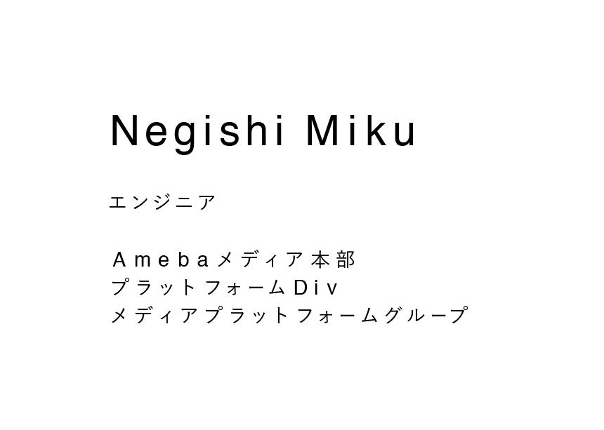

+++
bgcolor = false
comments = true
date = "2016-08-11T15:45:58+09:00"
draft = false
excerpt = "社内研修に参加してきました！"
image = ""
menu = ""
share = true
slug = "technical-creator"
tags = ["design"]
title = "テクニカルクリエイター研修"

+++

テクニカルクリエイターを目指す社内研修に参加してきました！  
メールが来て即応募したら、参加できることになりました。(∩´∀｀)∩ ラッキー  

<br>

#### テクニカルクリエイターとは

> 主にUIデザインをベースとして、UIアニメーションやインタラクティブな実装に特化した人材  <small>[テクニカルクリエイターについて　佐藤 洋介](https://www.cyberagent.co.jp/techinfo_detail/id=11321&season=2016&category=front)</small>

こう書いていたので、アニメーションをやるのかな？って最初は思っていたのですが  
今回の社内研修では、豪華講師陣に「デザインの基礎」を教えていただきました。  

自分はデザインの基礎をやってみたいと思っていたので願ってもないチャンスでした。  

<br>

#### 研修内容

2016年5月13日〜8月5日の期間、隔週くらいで研修がありました。  

研修の内容は「デッサン」「平面構成」「ロゴ&タイポグラフィ」「レイアウト」「自己紹介PCサイト作成」でした。  

アニメーションやデザインのツールの使い方、といった研修ではなく  
モノの見方や考え方、取り組み方などのデザインの根幹を教えていただきました。  

全体を通して、本当に有意義な研修でした。  

<br>

#### #1 デッサン  

最初の研修はデッサンでした。モチーフはレモン。🍋   

今回習ったデッサンのポイントは２つ。  
１．とにかく「観察」  
２．アウトラインからの脱却  

##### とにかく「観察」  

無知すぎて恥ずかしいのですが、デッサンは単純に絵を描く訓練かと思っていました。  
デッサンの本当の目的は **「観察力の筋トレ」**。 

自分は何も見えてないんだな〜ということに気付かされました。  
反射光の存在に今の今まで全然気付かなかった。  


##### アウトラインからの脱却

もうひとつのポイントがアウトラインからの脱却です。  
日本人は2Dで捉えがちなので、アウトラインではなく空間の奥行きを意識してデッサンするように言われました。  

デッサンは筋トレ・・・  

##### 自分の作品

写真撮るの忘れました・・・  
サイトにうっすら載ってました。笑  

  


##### ◎研修の詳しい様子

は、こちらです。↓  
[「テクニカルクリエイターを目指すエンジニアのためのデッサン講座」レポート](https://ww    w.cyberagent.co.jp/technicalcreator/article/id=12108)    

エンジニアの大先輩、三島木さんが書いたレポートです。  
すごいエンジニアはレポート書くのもうまいなぁ。  

<br>

#### #2 平面構成  

前回の研修の最後に、平面構成の課題が出ました。  
その課題の講評をするのが今回の研修内容でした。  

##### 課題

モチーフを「光」「風」「動」をテーマに平面構成をするのが課題でした。  
この課題が難しくて難しくて・・・！！！  

自分の所属チームのデザイナさんに相談しまくってなんとか課題をこなしました。  
課題を終わらせても何やらピンとこず・・・  

##### 講評会

同期のエンジニアよっしーの作品がいい感じ！って言われていて、  
たしかに綺麗だなーとは思ったけど、正直みんなの作品との違いがわからず・・・  

何が良くて何が悪いのか全くわからん！('ω')三( ε: )三(.ω.)三( :3 )ｺﾞﾛｺﾞﾛｺﾞﾛ  


##### メモメモ

わからないなりに、面白いなと思ったことをメモっておきます。  
・何を一番に見せたいか？を決めてそれを表現する  
・均等に無難に作るのは簡単。絶妙なバランスを攻めるのがデザイナの力量  
・結局は綺麗にみせなきゃダメよ  
・デザイナは自分なりの解釈をする訓練を常にしている   
・コンビニでもどこでも、デザイン見ちゃうね<small>（どこで情報仕入れているのかを質問した返答）</small>  

##### 自分の作品  

  

##### ◎研修の詳しい様子
 
[エンジニアがつくる、はじめてのデザイン！テクニカルクリエーター研修レポート](https://www.cyberagent.co.jp/technicalcreator/article/id=12145)  
大学の頃からお世話になっているリョータさんのレポートです。  

<br>


#### #3 ロゴ&タイポグラフィ

研修３回目は「ロゴデザイン」と「タイポグラフィ」でした。  

##### 課題内容

今回は課題が２つありました。  
- 自分のロゴマークをデザインする  
- 自分の名前と肩書き、所属をタイプする  

課題をやってる時に同期のデザイナさんが沢山コメントくれて嬉しかった  
ﾟ･*:･゜ヽ( ´∀｀)人(´∀｀ )ノ･゜ﾟ･*:.*  

##### 課題① 自分のロゴマークをデザインする

```
・テーマ、コンセプトを決めモチーフを設定する
　名前の特徴、自分の性格、趣味、生まれ、出身地、 自分の会社を作るとしたら、、、、などなんでもよい。
```

いくつか案を出したのですが、最終的に「negimic」をロゴにすることにしました。  

###### 作ったロゴ



先生からのコメント：  
文字は手書きでゆるい雰囲気なのに、顔の輪郭が正円なのが気になる。  
輪郭も手書きの円にするのはどう？  
（たしかにー！）  

<br>

##### 課題② 自分の名前と肩書き、所属をタイプする

初めて「カーニング」という存在を知りました・ω・  
これまた全く分からなすぎたので、所属チームのデザイナさんや同期のデザイナさんにいろいろと教えてもらいました。  

**いろいろ**  
- カーニングは文字詰め。  
- デザイナは必ずこれやってるよ！  
- 文字と文字の距離を均等にするんじゃなくて、文字と文字の空間を均等にしていく  
- 反転させたりするといいよ  
- 日本語と英語のフォントを変える  
<small>（日本語は**游ゴシック**、英語は**Helvetica**にした）</small>  
- 日本語のfontを1pt下げたり  

などなど  

###### カーニング



先生からのコメント：  
名前の文字間はいい感じだけど  
このくらい広い文字間でやるなら、行間ももっと取らないとだめ  
（たしかにーーー！！行間なんも考えてなかった）  

##### ◎研修の詳しい様子

[エンジニアも今すぐ始めたい「タイポグラフィ」と「ロゴデザイン」](https://www.cyberagent.co.jp/technicalcreator/article/id=12169)

大学の後輩の前川くんのレポートです。  
未来大出身者のレポート率（と参加率）高くないですか？笑  

<br>

疲れたので残りは次回。( ˙³˙ )ﾉ"  

<br>